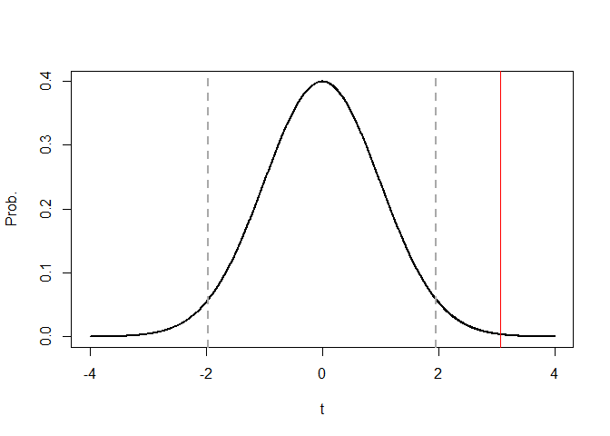
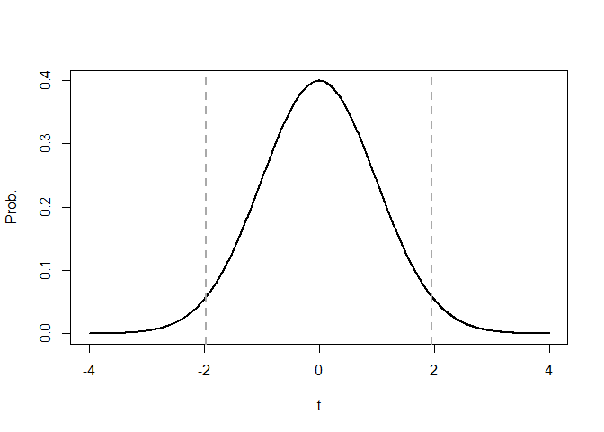

Understanding Regression Coefficients
================

This example conducts a “standard” regression using Ordinary Least
Squares, with the aim of understanding the main output and the
coefficients. The standard error, t-statistic, and p-value are related to one another and are used to test whether a coefficient is significant.

## Generating the Data

After setting the seed to make the data easier to reproduce, we generate
1,000 observations for *x*, *y*, and *z*. These are randomly
distributed, but *y* is a function of *x* with some random error added:
*y = 12x + e*. Variable *z* is totally independent from the other two.

``` r
set.seed(1)
x<-rnorm(1000)
y<-12*x+rnorm(1000,0,130) 
z<-rnorm(1000,5,2) 
```

## Running a Regression

Next, we perform OLS and look at the output. Our linear equation is *y =
b0 + b1_x + b2_x + e.* The three “beta” coefficents are calculated using
matrix algebra, but we only see the output.

``` r
reg<-lm(y~x+z)
summary(reg)
```

    ## 
    ## Call:
    ## lm(formula = y ~ x + z)
    ## 
    ## Residuals:
    ##     Min      1Q  Median      3Q     Max 
    ## -423.43  -87.22   -2.74   98.02  474.81 
    ## 
    ## Coefficients:
    ##             Estimate Std. Error t value Pr(>|t|)   
    ## (Intercept)   -9.447     11.299  -0.836  0.40328   
    ## x             12.693      4.141   3.065  0.00224 **
    ## z              1.459      2.078   0.702  0.48272   
    ## ---
    ## Signif. codes:  0 '***' 0.001 '**' 0.01 '*' 0.05 '.' 0.1 ' ' 1
    ## 
    ## Residual standard error: 135.3 on 997 degrees of freedom
    ## Multiple R-squared:  0.01005,    Adjusted R-squared:  0.008067 
    ## F-statistic: 5.062 on 2 and 997 DF,  p-value: 0.006496

The most important parts of this table are the coefficient; one of
either the standard error, the t-statistic, or the p-value; and
R-squared.

We save these parts of the output. The specific (row,column) values
correspond to what we need.

``` r
coeffs<-summary(reg)[4] # to use on graph
bx<-coeffs$coefficients[2,1] # beta (coefficient)
bz<-coeffs$coefficients[3,1]
sx<-coeffs$coefficients[2,2] # standard error
sz<-coeffs$coefficients[3,2]
```

## Evaluating the Coefficients

Because of the natural variation in the data, the “point” estimates
contain a certain amount of error. We need to test the hypothesis that
an esimate of *beta* is significantly different from zero. This is done
via a t-test of *(beta - zero)/s.e.* with a null hypothesis of no
difference. Dividing the coefficient by the standard error gives the
t-statistic; you can check this using the regression output.

The “critical value” depends on the sample size, but is often rounded to
2 (at 5%). Any t-statistic above 2 (in absolute value) suggests that the
coefficient is large enough to not be due to randomness. For a
two-tailed test, that means that only 2.5% of the total probability is
greater than this t-statistic.

We can graph a t-distribution based on our data, getting the number of
degress of freedom from our output. We can make a range *x1* for the
x-axis and probabilities *y1* for each point along that axis. We use
*dt()* to get these. We can also get the 95% critical value using *qt()*
and the degrees of freedom. It’s almost, but not quite, 2.

``` r
x1<-seq(-4,4,length=1000)
df<-reg$df.residual
y1<-dt(x1,df)
q5<-qt(0.975,df) # critical value for beta/se at 5%
q5
```

    ## [1] 1.962346

Now we plot this t-distribution, adding dashed lines for the +/- 2
standard error bands. Then, we add a red line for the calculated
statistic. It is larger than the critical value, so we can say that the
coefficient for *x* is significant.

``` r
plot(x1,y1,type = "l",lwd=2,ylab="Prob.",xlab="t") # basic curve
abline(v=qt(0.975,df),lty=2,lwd=2,col="dark gray") # +0.025
abline(v=qt(0.025,df),lty=2,lwd=2,col="dark gray") # -0.025
abline(v=bx/sx,col="red") # calculated t-statistic for this regression
```

<!-- -->

## Testing Hypotheses

We begin by testing whether *x* is significant. We calculate the
t-statistic (by hand) and “look up” the corresponding p-value. Note the
formula, which uses *pt()*, gets the p-value from the t-distribution.
Since we want the area under the curve to the right of our t-statistic,
we have to subtract from the total (which equals 1). Note that we double
the value for a two-sided test. Pulling up our regression output shows
that the values match.

``` r
bx/sx # (beta - zero)/se = t
```

    ## [1] 3.064944

``` r
2*(1-pt(bx/sx,df)) # p-value
```

    ## [1] 0.002235679

``` r
coeffs$coefficients[2,] # show results to compare
```

    ##     Estimate   Std. Error      t value     Pr(>|t|) 
    ## 12.692658927  4.141236677  3.064944102  0.002235679

We can do the same thing for the variable *z*. Since this was created to
be independent from *y*, it is no surprise that the t-statistic is low
and the p-value is high. It is insignificant and we cannot reject the
null hypotheses that *z* has no effect on *y*.

``` r
plot(x1,y1,type = "l",lwd=2,ylab="Prob.",xlab="t") # basic curve
abline(v=qt(0.975,df),lty=2,lwd=2,col="dark gray") # +0.025
abline(v=qt(0.025,df),lty=2,lwd=2,col="dark gray") # -0.025
abline(v=bz/sz,col="red")
```

<!-- -->

We see the same thing when we calculate the values independently.

``` r
bz/sz
```

    ## [1] 0.7021932

``` r
2*(1-pt(bz/sz,df))
```

    ## [1] 0.4827226

``` r
coeffs$coefficients[3,] # show results to compare
```

    ##   Estimate Std. Error    t value   Pr(>|t|) 
    ##  1.4593450  2.0782671  0.7021932  0.4827226

We can also calculate 95% Confidence Intervals,but in my experience they
are not used that much in Economics.

``` r
bands<-rbind(c(bx-q5*sx,bx+q5*sx),c(bz-2*sz,bz+2*sz))
rownames(bands)<-c("x","z")
colnames(bands)<-c("-2se","+2se")
round(bands,3)
```

    ##     -2se   +2se
    ## x  4.566 20.819
    ## z -2.697  5.616

Note that the interval for *z* crosses zero–we cannot say that it is
nonzero. But the coefficient for *x* is significantly positive.

We can look at the regression output again.

``` r
summary(reg)
```

    ## 
    ## Call:
    ## lm(formula = y ~ x + z)
    ## 
    ## Residuals:
    ##     Min      1Q  Median      3Q     Max 
    ## -423.43  -87.22   -2.74   98.02  474.81 
    ## 
    ## Coefficients:
    ##             Estimate Std. Error t value Pr(>|t|)   
    ## (Intercept)   -9.447     11.299  -0.836  0.40328   
    ## x             12.693      4.141   3.065  0.00224 **
    ## z              1.459      2.078   0.702  0.48272   
    ## ---
    ## Signif. codes:  0 '***' 0.001 '**' 0.01 '*' 0.05 '.' 0.1 ' ' 1
    ## 
    ## Residual standard error: 135.3 on 997 degrees of freedom
    ## Multiple R-squared:  0.01005,    Adjusted R-squared:  0.008067 
    ## F-statistic: 5.062 on 2 and 997 DF,  p-value: 0.006496

Note the relationship between the standard error, t-stastic, and
p-value. In general, you only want to report one of the three, but you
have to clearly state which one it is. The other important value to
include in your table is R-squared. I suggest looking at some
professional papers to see how most of the other information is excluded
from the final table.

Finally, we can test the hypothesis that the coefficient on *x* (which I
named *b1*) = 12. For this, we would need the standard error, since the
given t-statistic is calculated on the assumption that the coefficient
is tested against zero. Here, the calculations we did “by hand” are
useful. We can see that our new t-statistic is too small to be
significant.

``` r
stat12<-(bx-12)/sx # t-statistic
stat12
```

    ## [1] 0.167259

``` r
2*(1-pt(stat12,df)) # not significant
```

    ## [1] 0.8672002

As an additional exercise, we can make a new *z* that is related to *y*.
If you ever see the number “2e-16”, that means there are 16 zeros to the
*right* of the decimal point. (For example, 2E+3 = 2x1000 = 2000 and
2\*E-3 = 0.002).

Look at the output table. What do the coefficients tell us?

``` r
# Interpret this!
z1<--1.5*y+rnorm(1000,0,400) 
summary(lm(y~x+z1))
```

    ## 
    ## Call:
    ## lm(formula = y ~ x + z1)
    ## 
    ## Residuals:
    ##     Min      1Q  Median      3Q     Max 
    ## -433.24  -80.96   -1.69   86.49  446.45 
    ## 
    ## Coefficients:
    ##              Estimate Std. Error t value Pr(>|t|)    
    ## (Intercept) -0.851825   3.869874  -0.220  0.82583    
    ## x           11.599260   3.740985   3.101  0.00199 ** 
    ## z1          -0.125813   0.008426 -14.932  < 2e-16 ***
    ## ---
    ## Signif. codes:  0 '***' 0.001 '**' 0.01 '*' 0.05 '.' 0.1 ' ' 1
    ## 
    ## Residual standard error: 122.3 on 997 degrees of freedom
    ## Multiple R-squared:  0.1906, Adjusted R-squared:  0.189 
    ## F-statistic: 117.4 on 2 and 997 DF,  p-value: < 2.2e-16
